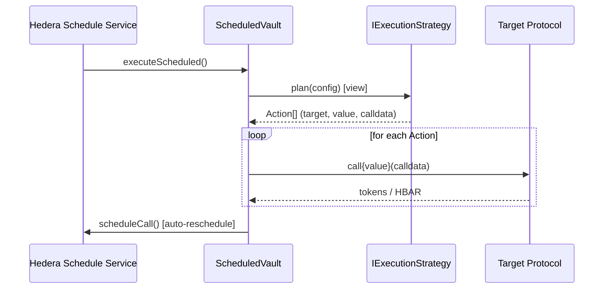

# Foundry package (Payments Scheduler)

Foundry contracts, scripts, and tests for **Hedera**, supporting recurring **scheduled execution** (payments, DCA-style flows, and similar) via the **Hedera Schedule Service (HSS)** system contract at `0x000000000000000000000000000000000000016B`.

### Core idea

The design is a generic **ScheduledVault** plus pluggable **IExecutionStrategy** contracts: each strategy **plans** an ordered list of low-level calls; the vault custodies funds and executes those calls on each schedule tick.

**Target networks:** Intended for **Hedera testnet and mainnet**; Hedera network forking does not support Schedule Service yet, so real HSS behavior is validated on those networks.

### Example

**MemeJob DCA** (`MemejobDCAStrategy`) is an **example** `IExecutionStrategy`: it shows config encoding, slippage and balance checks in `plan()`, and returning `Action[]` for MemeJob buy/sell. Copy the pattern into your own strategy contracts.

## Features

- **ScheduledVaultFactory** — deploys a **ScheduledVault** per user, bound to a chosen **IExecutionStrategy** (users can hold multiple vaults).
- **ScheduledVault**
  - Custodies assets; drives recurring on-chain work via **HSS** (Hedera Schedule Service).
  - Holds the strategy reference and encoded config (`bytes` + interval).
  - Each run: `strategy.plan` → execute returned **actions** → schedule the next execution.
- **MemejobDCAStrategy** — **example** `IExecutionStrategy`: DCA buy/sell against MemeJob (illustrates encoding, slippage, and `plan()` shape); replace or extend with your own plugins.

## Architecture

Runtime flow when a schedule fires (HSS system contract `0x…16B`):




The diagram shows **one execution tick** (HSS → vault → strategy → targets → reschedule).

### Typical Lifecycle

1. **Create** — `ScheduledVaultFactory.createVault(strategy)`; the strategy address is fixed for that vault instance.
2. **Configure** — Owner calls `configure(bytes, interval)`; config must pass `strategy.validateConfig`.
3. **Queue first run** — Owner calls `scheduleNextRun()` so HSS schedules the initial execution.
4. **Each due time** — `executeScheduled()` runs as in the sequence above (including auto-reschedule when successful).
5. **On failures** — Failed actions increment **consecutive failures**; if **maxConsecutiveFailures** is set and reached, auto-rescheduling stops.

## Components


| Area                                                           | Role                                                                                                   |
| -------------------------------------------------------------- | ------------------------------------------------------------------------------------------------------ |
| `contracts/ScheduledVault.sol`                                 | Generic HSS vault + strategy config + execution loop                                                   |
| `contracts/ScheduledVaultFactory.sol`                          | `createVault(address _strategy)` per user                                                              |
| `contracts/strategies/MemejobDCAStrategy.sol`                  | Example `IExecutionStrategy` (MemeJob DCA); model for your own strategies                              |
| `contracts/interfaces/IExecutionStrategy.sol`                  | `plan` + `validateConfig` plugin API                                                                   |
| `script/Deploy.s.sol`                                          | Default: factory + **example** `MemejobDCAStrategy` in one broadcast                                   |
| `script/DeployFactory.s.sol`, `DeployMemejobDCAStrategy.s.sol` | Split deploys                                                                                          |
| `test/`                                                        | `ScheduledVault.t.sol`, `ScheduledVaultFactory.t.sol`, `strategies/MemejobDCAStrategy.t.sol` (+ mocks) |
| `scripts-js/generateTsAbis.js`                                 | Optional post-deploy: reads `broadcast/` + `deployments/` (output paths configured in the script)      |


RPC names and URLs live in `[foundry.toml](foundry.toml)` under `[rpc_endpoints]`.

## Prerequisites and setup

**Install deps**

```bash
yarn install
```

**Install forge deps**

```bash
forge install foundry-rs/forge-std gnsps/solidity-bytes-utils hashgraph/hedera-forking
```

## Build

```bash
make compile
# or
yarn compile
# or
forge build
```

### Format & lint

```bash
make format   # forge fmt + prettier --write on scripts-js
make lint     # forge fmt --check + prettier --check
```

Solidity style is defined by `[fmt]` in `[foundry.toml](foundry.toml)`. The repo may include `[.vscode/settings.json](../../.vscode/settings.json)` so Cursor/VS Code users with the **Nomic Foundation Solidity** extension can use **forge** on save; if you use another editor, run `make format` before opening a PR.

## Test


| Command                    | What it does                                                                                                                                                                                                                                                                           |
| -------------------------- | -------------------------------------------------------------------------------------------------------------------------------------------------------------------------------------------------------------------------------------------------------------------------------------- |
| `yarn test` / `forge test` | Default Forge profile: unit tests with **mock HSS** etched at `0x16b` (`ScheduledVault`, factory, `MemejobDCAStrategy` tests).                                                                                                                                                         |
| `forge coverage`           | Same default suite as `forge test`, with **line/branch coverage** (slower). Flags: `--report summary` (compact table), `--report lcov --report-file lcov.info` (Codecov / genhtml).                                                                                                    |
| `yarn test:local`          | Forks `http://127.0.0.1:8545` with chain id **296** and `--ffi`. Start a **Hedera-aligned** RPC on that port first: `make fork` or `yarn fork` (Anvil forked from Hashio testnet). Do **not** use `make chain` / `yarn chain` for these tests (that is vanilla Anvil, wrong chain id). |
| `yarn test:testnet`        | Fork Hedera testnet RPC (`HEDERA_RPC_URL` or default in `foundry.toml`) + `--ffi`.                                                                                                                                                                                                     |
| `yarn test:mainnet`        | Fork Hedera mainnet (read-heavy / snapshot style checks).                                                                                                                                                                                                                              |


Forking background: [Forking the Hedera network for local testing](https://docs.hedera.com/hedera/core-concepts/smart-contracts/forking-hedera-network-for-local-testing).

## Deploy

- **Localhost:** `make chain` or `yarn chain` starts **vanilla Anvil** (chain id 31337). Default deploy uses keystore `**scaffold-hbar-default`** (imported by the Makefile with password `localhost`).
  ```bash
  yarn deploy
  ```
  This runs **`script/Deploy.s.sol`** (factory + **example** `MemejobDCAStrategy`) unless you pass `--file`. Under the hood this invokes `make deploy` with the right `RPC_URL` / `DEPLOY_SCRIPT` / keystore env (see `scripts-js/parseArgs.js`).
- **Hedera testnet / mainnet:** use a keystore whose address is a **Hedera-created** account (portal / faucet). If you see `Requested resource not found. address '0x...'`, create/import an account with `yarn account:import` and deploy with `--keystore <name>`.
  ```bash
  yarn deploy --network hedera_testnet
  yarn deploy --network hedera_mainnet --keystore my-account
  ```
- **Split deploys** (same as `Deploy.s.sol` but separate transactions / broadcasts):
  ```bash
  yarn deploy --file DeployFactory.s.sol --network hedera_testnet
  yarn deploy --file DeployMemejobDCAStrategy.s.sol --network hedera_testnet
  ```
- **Make-only deploy** (same as `yarn deploy` on localhost when you set variables yourself): `make deploy` with `RPC_URL`, `DEPLOY_SCRIPT`, and `ETH_KEYSTORE_ACCOUNT` (see `Makefile` and `scripts-js/parseArgs.js`).

The Makefile uses `--slow` on non-localhost RPCs so transactions confirm in order (reduces `WRONG_NONCE` on Hedera).

`yarn deploy` also runs `**generate-abis`** (`scripts-js/generateTsAbis.js`), which merges `broadcast/` and `deployments/` into generated bindings (see the script for output paths). You can run `**make generate-abis`** alone if needed.

## Verify (Hashscan / Sourcify v1)

After deploying to Hedera testnet (296) or mainnet (295):

```bash
yarn verify:testnet   # chain 296
yarn verify:mainnet   # chain 295
```

Verification reads `broadcast/Deploy.s.sol/<chainId>/run-latest.json` (same path as a default `**yarn deploy**`). If you only used split deploy scripts, run a full deploy with `**Deploy.s.sol**` on that network before `**yarn verify:***`, or verify contracts manually on Hashscan.

Single contract:

```bash
yarn verify:contract MemejobDCAStrategy testnet
```

For any contract **in this package** (you have its build artifact under `out/` after `forge build`), if it is **already on-chain** at a known address but **not** present in the deployment broadcast, verify it by passing the **address as a third argument**. The tool uses `out/<Contract>.sol/<Contract>.json` for metadata instead of resolving a `CREATE` from `run-latest.json`:

```bash
yarn verify:contract ScheduledVault testnet 0xYourVaultAddress
# network and address can be swapped:
yarn verify:contract ScheduledVault 0xYourVaultAddress mainnet
```

Requires `forge build` so `out/<Contract>.sol/<Contract>.json` exists. The on-chain bytecode must match that build (same compiler settings and sources).

**Note:** `make verify RPC_URL=localhost` does not use Hashscan. For Hedera verification use `**yarn verify:testnet`** / `**yarn verify:mainnet`**, or `make verify` with `RPC_URL=hedera_testnet` or `hedera_mainnet`.

## Using this repo as a starter

1. Clone / fork; install the monorepo from the repository root if applicable; run `forge install` from **this directory** (see [Prerequisites](#prerequisites-and-setup)).
2. Configure RPC / env if needed (`foundry.toml`, `.env` in this package).
3. Deploy factory and **your** strategy (default script still ships the Memejob example), fund testnet via [Hedera Portal faucet](https://portal.hedera.com/faucet) when needed.
4. Use `**cast`**, `**forge script`**, or your own tooling against deployed addresses.

## Adding a new execution strategy

1. Implement `IExecutionStrategy`: `validateConfig(bytes)` and `plan(bytes)` returning `Action[]` (`target`, `value`, `data`). Keep `plan` a `view` where possible; if you use `msg.sender` / balances, remember `**msg.sender` is the vault** when the node simulates or when Forge runs staticcalls.
2. Add `script/DeployYourStrategy.s.sol` following `DeployMemejobDCAStrategy.s.sol` (push to `deployments` via `ScaffoldETHDeploy`).
3. Add `test/YourStrategy.t.sol` (mock external protocols / tokens as needed).
4. Users call `ScheduledVaultFactory.createVault(address(yourStrategy))`, then `configure` with ABI-encoded config matching your struct(s). Encode off-chain the same shapes your strategy decodes (see `MemejobDCAStrategy` + tests for reference).

## Make targets and variables

Many `**yarn <script>`** entries in `[package.json](package.json)` call these Make targets. Common variables: `**RPC_URL`**, `**DEPLOY_SCRIPT**`, `**ETH_KEYSTORE_ACCOUNT**`, `**ACCOUNT_NAME**` (for `get-address`).

## Links

- [Hedera Schedule Service](https://docs.hedera.com/hedera/core-concepts/smart-contracts/system-smart-contracts/hedera-schedule-service)
- [Foundry Book](https://book.getfoundry.sh/)

## Disclaimer

This package is a **starter template** only. The contracts, scripts, and documentation are **not** a substitute for a professional security audit, legal review, or operational hardening. Nothing here is warranted **production-ready** or fit for handling real funds without your own due diligence. You assume all risk; use is at your sole responsibility.

## License

This package is **open source** under the **MIT** license. Solidity files declare `SPDX-License-Identifier: MIT` unless a given file specifies otherwise.